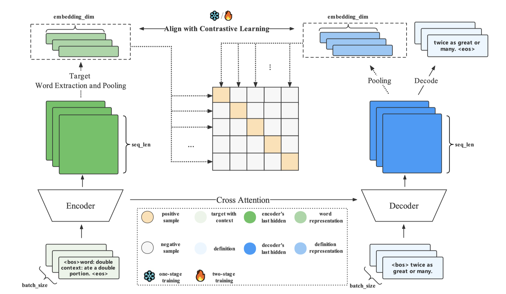

# Definition-Gneration-Contrastive
This is the code repository of our AACL-IJCNLP 2022 paper "[Fine-grained Contrastive Learning for Definition Generation](https://aclanthology.org/2022.aacl-main.73.pdf)"


# 🚀 Introduction

To address under-specific error in DG task, we regard the "word" and corresponding "definition" as a positive pair and then implement the batch contrastive learning with a two-stage training technique. 




## 📄 Get Started

## 📝 Setup

```
conda env create -f environment.yaml

# important package
pytorch-lightning (0.9.0)
transformers (3.1.0)
pytorch (1.6.0)
```


## 📥 Data

Download datasets collected from [ishiwatari](https://aclanthology.org/N19-1350/).

``` 
wget http://www.tkl.iis.u-tokyo.ac.jp/~ishiwatari/naacl_data.zip
unzip naacl_data.zip
```


## ⛳️ Run

Change the variable in `finetune-t5-experiment.sh`, the important variables are as follows: 

```shell
DATASET=wordnet

#! first stage
TASK=def-gen
NUM_EPOCHS_STAGE_ONE=50
EARLY_STOP_STAGE_ONE=10
T5_OUTPUT_DIR_STAGE_ONE=output/$DATASET-def-gen
CONTRASTIVE_RATIO_STAGE_ONE=0.0
STAGE=stage-one

train_pipeline "$EARLY_STOP_STAGE_ONE" "$T5_OUTPUT_DIR_STAGE_ONE" "$NUM_EPOCHS_STAGE_ONE" "$TASK" "$CONTRASTIVE_RATIO_STAGE_ONE" "$STAGE"

#! second stage
TASK=def-gen-with-contras
NUM_EPOCHS_STAGE_TWO=50
EARLY_STOP_STAGE_TWO=10
CKPT_PATH=$T5_OUTPUT_DIR_STAGE_ONE
T5_OUTPUT_DIR_STAGE_TWO=output/$DATASET-def-gen-with-contras
CONTRASTIVE_RATIO_STAGE_ONE=0.8
STAGE=stage-two

train_pipeline "$EARLY_STOP_STAGE_TWO" "$T5_OUTPUT_DIR_STAGE_TWO" "$NUM_EPOCHS_STAGE_TWO" "$TASK" "$CONTRASTIVE_RATIO_STAGE_TWO" "$STAGE"


```

Noted that, we follow the evaluation procedure of [T5-Reranking project](https://github.com/amanotaiga/Definition_Modeling_Project/tree/main)


## 📚 Citation

If you use this repo in your research, please cite it as follows:

``` 
@inproceedings{zhang-etal-2022-fine-grained,
    title = "Fine-grained Contrastive Learning for Definition Generation",
    author = "Zhang, Hengyuan  and
      Li, Dawei  and
      Yang, Shiping  and
      Li, Yanran",
    booktitle = "Proceedings of the 2nd Conference of the Asia-Pacific Chapter of the Association for Computational Linguistics and the 12th International Joint Conference on Natural Language Processing (Volume 1: Long Papers)",
    month = nov,
    year = "2022",
    address = "Online only",
    publisher = "Association for Computational Linguistics",
    url = "https://aclanthology.org/2022.aacl-main.73",
    pages = "1001--1012"
}
```

